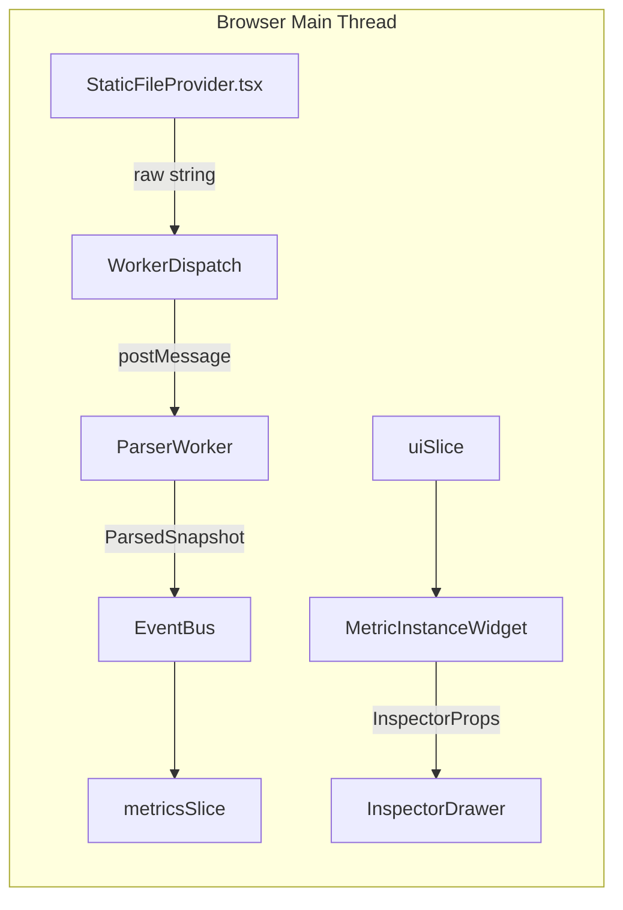

# IntelliMetric Explorer – Overview  
*(Nano-module architecture · Inspector 1.1 focus)*

---

## 1. Why this tool exists

Modern observability data is high-volume and high-cardinality. Even a **single
OTLP metrics snapshot** can contain **hundreds of thousands of individual
series**. IntelliMetric Explorer was born to answer one deceptively simple
question:

> *"What exactly does **this one** data-point mean, and how much does it cost me
> in series‐cardinality?"*

To do that without freezing a browser, we use:

| Pillar                  | How we achieve it                                                        |
| ----------------------- | ------------------------------------------------------------------------ |
| *Microscopic focus*     | The flagship **Data-Point Inspector Drawer 1.1** renders **one** point. |
| *Local cardinality IQ*  | C-Ring, P-Rarity Dots & Cardinality Capsule show "series math" at a glance. |
| *Nano-module codebase*  | Every file ≈ 50-150 LoC → faster tests, safer refactors.                |
| *60 ms FCP budget*      | All heavy work (parsing, cardinality math) done **before** props hit React. |

---

## 2. High-level data journey

Only one round-trip to a Web Worker per file; everything else stays on-thread.

## 3. Layers at a glance
| Layer | Key nano-modules (⇢ spec files) |
|-------|----------------------------------|
| Data Provider | fileValidator · decompressGzip · readFile · dispatchToWorker |
| Parser Worker (WebWorker) | jsonSafeParse → otlpMapper (calls seriesKeyEncoder, exemplarExtractor) |
| Metric Processor (logic) | attributeStats · seriesCardinalityCalc · wrapper metricProcessor |
| Global State (Zustand) | metricsSlice · uiSlice |
| UI Hooks | useSnapshot · useInspectorProps · useDropSimulation |
| UI Atoms→Organisms→Layouts | culminate in DataPointInspectorDrawer |

## 4. External tech
- React 18 + Vite – fast dev HMR, easy worker bundling
- Zustand + immer – global state slices, immutable updates
- mitt – micro-event-bus (< 400 bytes)
- pako – gzip inflating in-browser
- uPlot – 6 kB sparkline (optional)
- CSS Modules + tokens.css – local styles, global design-tokens only

## 5. Reading order for newcomers
- 01-Architecture-Principles.md – contract & boundaries
- 03-Data-Contracts.md – every shared TypeScript interface

Pick a path:
- Backend-ish? Read data/*.md → workers/*.md → processing/*.md.
- Frontend? Jump to ui/atoms/*.md up the tree, then inspect DataPointInspectorDrawer.md.

Happy tracing!