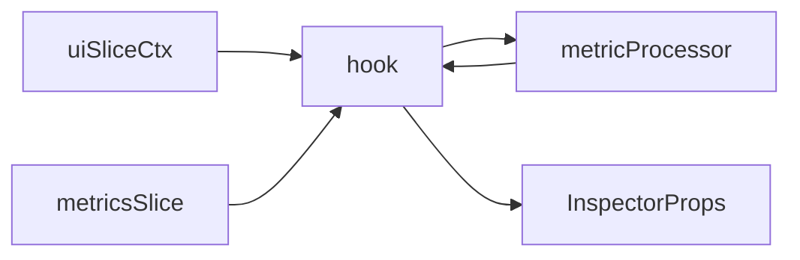

# useInspectorProps.ts – spec  
*(Hook nano-module · builds Data-Point Inspector props)*

---

## 1. Purpose

Combine **three sources** into a single, memoised `InspectorProps`
object for `DataPointInspectorDrawer`:

1. UI pointers from `uiSlice` (snapshotId, metric, seriesKey, pointId)
2. Parsed data from `metricsSlice`
3. Cardinality context via `getProcessedMetricInfo`

Returns **`null`** until all required pieces are available.

---

## 2. Public API

```ts
// src/hooks/useInspectorProps.ts
import type { InspectorProps } from '@/contracts/types';

/**
 * Resolve the fully-assembled props for the Inspector drawer.
 * Returns null if context incomplete or data missing.
 * 
 * @param simulateDropKey Optional attribute key to simulate dropping
 * for cardinality reduction demonstration
 */
export function useInspectorProps(
  simulateDropKey?: string | null
): InspectorProps | null;
```

## 3. Internal Flow



Algorithm (simplified):

```ts
const {
  activeSnapshotId,
  inspectedMetricName,
  inspectedSeriesKey,
  inspectedPointId,
  isInspectorOpen
} = useUiSlice(selector)

if !isInspectorOpen → return null
if !all ids present → return null

snapshot = useSnapshot(activeSnapshotId)
if !snapshot → return null

metricInfo = getProcessedMetricInfo(snapshot, inspectedMetricName, {
  simulateDropAttributeKey: simulateDropKey
})

series = snapshot.resources[...] // helper findSeriesByKey
point  = series.points.find(p => p.timestampUnixNano === inspectedPointId)

if !series || !point → return null

return {
  metricName : metricInfo.definition.name,
  seriesKey  : inspectedSeriesKey,
  point,
  resourceAttrs: series.resourceAttributes,
  metricAttrs  : series.metricAttributes,
  metricDefinition: metricInfo.definition,
  cardinality : {
    ...metricInfo.cardinality,
    attrOfPoint : Object.keys(series.metricAttributes).concat(
                    Object.keys(series.resourceAttributes)
                  ),
    thresholdHigh: 2000  // TODO: global config
  },
  exemplars : point.exemplars,
  onClose   : () => uiActions.closeInspector(),
  onAddGlobalFilter: (k,v)=> uiActions.addFilter(k,v), // future
  onSimulateDrop  : (key,drop) => {
    // Call the uiSlice action which updates global state
    uiActions.toggleSimDrop(key, drop);
  },
  metricLatestNValues: undefined  // Caller may pass later
}
```

Outputs are stable-reference-memoised via useMemo keyed on the
identifiers; prevents unnecessary Inspector re-renders.

## 4. Dependencies
Hooks: useSnapshot

State slices: uiSlice, metricsSlice

Logic: metricProcessor

Utility: helper findSeriesData(snapshot, metricName, seriesKey)

## 5. Consumers
MetricInstanceWidget – passes return value directly to
<DataPointInspectorDrawer {...props}/>

## 6. Integration with Drop Simulation

```tsx
// src/components/MetricInstanceWidget.tsx
function MetricInstanceWidget() {
  // Get current UI drop simulation state
  const dropSimActive = useUiSlice(
    (state) => state.dropSimulation?.isActive || false
  );
  const dropKey = useUiSlice(
    (state) => dropSimulation?.attributeKey || null
  );
  
  // Get inspector props with the current drop key
  const inspectorProps = useInspectorProps(
    dropSimActive ? dropKey : null
  );
  
  // ...render drawer with props
}
```

The useInspectorProps hook now passes the simulation drop key to metricProcessor:

```ts
metricInfo = getProcessedMetricInfo(snapshot, inspectedMetricName, {
  simulateDropAttributeKey: simulateDropKey 
})
```

This allows metricProcessor to calculate the updated series count with the attribute dropped.

## 7. Edge Cases
| Case | Result |
|------|--------|
| Snapshot deleted while open | returns null → parent unmounts Inspector |
| Metric missing (name typo) | null |
| Point timestamp not found | null |
| Drop key that doesn't exist | No change in cardinality context |

Parent component must hide the drawer if props become null.

## 8. Tests
| Scenario | Expect |
|----------|--------|
| All context set → returns valid props | object with correct metricName |
| Missing seriesKey → returns null | |
| Snapshot removed after open → null | Inspector unmount simulation passes |
| Memoisation: identical inputs → same ref | prev === next |
| With simulateDropKey → cardinality updated | seriesCount lower than without |

## 9. Performance
Heavy work (metricProcessor) memoised by snapshot object reference +
metric name; recompute occurs only on simulate-drop or new snapshot load.

End-to-end hook execution ≤ 10 ms for 100 k-series metric.

## 10. Future Plans
Integrate micro-trend sparkline: hook may slice last N points for
the selected series once chart organism added.