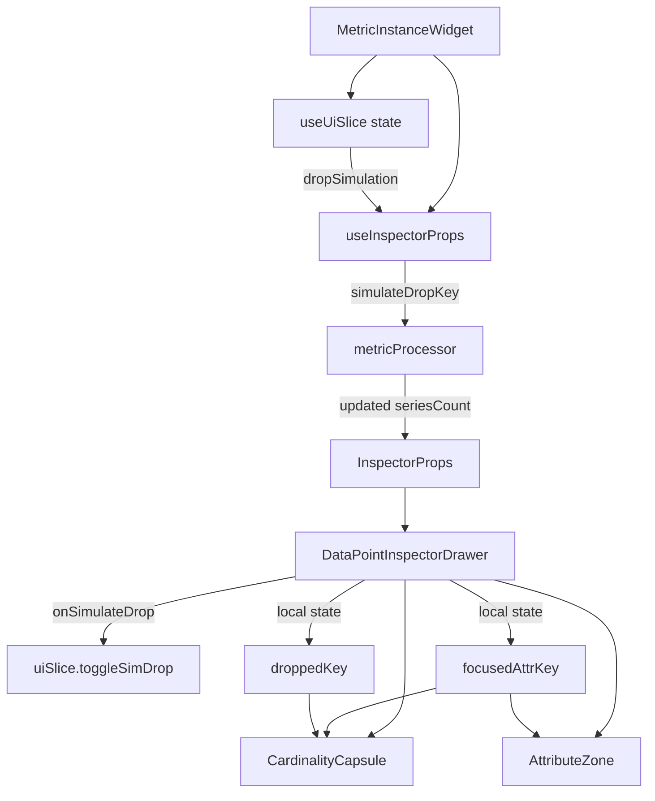

# DataPointInspectorDrawer.tsx – spec  
*(UI Layout · main slide-in drawer for data point inspection)*

---

## 1. Purpose

Render a **comprehensive drawer UI** that displays all facets of a single metric
data point, including:

* Metric definition and value
* Resource and metric attributes with cardinality indicators
* Cardinality visualization and simulation controls
* Exemplar data (when available)
* Raw JSON view with copy functionality

This is the flagship component of the IntelliMetric Explorer.

---

## 2. Public Props

```ts
// src/ui/organisms/DataPointInspectorDrawer.tsx
import type { InspectorProps } from '@/contracts/types';

export interface DataPointInspectorDrawerProps extends InspectorProps {
  // InspectorProps already contains:
  // - metricName, seriesKey, point
  // - resourceAttrs, metricAttrs
  // - metricDefinition, cardinality
  // - exemplars
  // - onClose, onAddGlobalFilter, onSimulateDrop
  // - metricLatestNValues
  
  /** Optional classname for drawer container */
  className?: string;
  
  /** Whether to show drawer on right (true) or left (false) */
  positionRight?: boolean;
}
```

## 3. Layout Structure

```tsx
<div className={styles.drawerContainer}>
  <InspectorHeader 
    metricDefinition={metricDefinition}
    seriesCount={cardinality.seriesCount}
    thresholdHigh={cardinality.thresholdHigh}
    onClose={onClose}
  />
  
  <div className={styles.content}>
    <AdaptiveValueDisplay 
      point={point}
      metricDefinition={metricDefinition}
      latestValues={metricLatestNValues}
    />
    
    <CardinalityCapsule
      seriesCount={cardinality.seriesCount}
      thresholdHigh={cardinality.thresholdHigh}
      attrRank={cardinality.attrRank}
      attrUniq={cardinality.attrUniq}
      focusedAttrKey={focusedAttrKey}
      onFocusAttr={setFocusedAttrKey}
      onToggleDrop={handleToggleDrop}
      isDropSimActive={!!droppedKey}
      droppedKey={droppedKey}
    />
    
    <AttributeZone
      resourceAttrs={resourceAttrs}
      metricAttrs={metricAttrs}
      attrUniq={cardinality.attrUniq}
      focusedAttrKey={focusedAttrKey}
      onFocusAttr={setFocusedAttrKey}
      onAddGlobalFilter={onAddGlobalFilter}
    />
    
    {exemplars && exemplars.length > 0 && (
      <ExemplarsZone exemplars={exemplars} />
    )}
    
    <RawJsonZone
      metricName={metricName}
      point={point}
      resourceAttrs={resourceAttrs}
      metricAttrs={metricAttrs}
    />
  </div>
</div>
```

## 4. State Management

```ts
// Local component state
const [focusedAttrKey, setFocusedAttrKey] = useState<string | null>(null);
const [droppedKey, setDroppedKey] = useState<string | null>(null);

// Handle drop simulation toggle from CardinalityCapsule
const handleToggleDrop = useCallback((attrKey: string, nextState: boolean) => {
  // First call parent callback to trigger recalculation in global state 
  if (onSimulateDrop) {
    onSimulateDrop(attrKey, nextState);
  }
  
  // Then update local state for UI feedback
  setDroppedKey(nextState ? attrKey : null);
}, [onSimulateDrop]);
```

### 4.1 Attribute Focus State Flow

The `focusedAttrKey` state is:
- Maintained locally in the drawer component
- Shared between AttributeZone and CardinalityCapsule
- Set when a user clicks an attribute in either component
- Cleared when clicking the same attribute again
- Used to highlight the focused attribute in both components

Focus state flow:
1. User clicks an attribute in AttributeZone
2. AttributeZone calls `onFocusAttr(key)`
3. Drawer sets `focusedAttrKey` state
4. Both AttributeZone and CardinalityCapsule get updated `focusedAttrKey` prop
5. CardinalityCapsule uses this key to enable its simulation controls

### 4.2 Drop Simulation State Flow

The drop simulation state follows this flow:
1. User checks "Simulate drop" checkbox in CardinalityCapsule
2. CardinalityCapsule calls `onToggleDrop(focusedAttrKey, true)`
3. Drawer component:
   - Sets local `droppedKey` state to `focusedAttrKey`
   - Calls parent `onSimulateDrop(focusedAttrKey, true)`
4. Parent (MetricInstanceWidget) calls uiSlice.toggleSimDrop action
5. useInspectorProps recalculates props with simulateDropKey parameter
6. Updated props flow back to drawer with new seriesCount

The drawer maintains local state for UI purposes, while the actual simulation calculation happens in the parent component via the global state.

## 5. CSS & Styling

```css
.drawerContainer {
  position: fixed;
  top: 0;
  bottom: 0;
  width: 660px;
  background: var(--surfaceBg);
  box-shadow: 0 0 20px rgba(0, 0, 0, 0.25);
  z-index: 1000;
  display: flex;
  flex-direction: column;
  overflow: hidden;
}

.positionRight {
  right: 0;
  border-left: 1px solid var(--borderColor);
}

.positionLeft {
  left: 0;
  border-right: 1px solid var(--borderColor);
}

.content {
  padding: 16px;
  overflow-y: auto;
  display: flex;
  flex-direction: column;
  gap: 24px;
}
```

## 6. Animation & Transitions

Entrance/exit animation with CSS transitions:

```css
.drawerContainer {
  transition: transform 250ms ease-out;
}

.entering, .exiting {
  transform: translateX(100%);
}

.entered {
  transform: translateX(0);
}
```

## 7. Callbacks

| Callback | Purpose | Implementation |
|----------|---------|----------------|
| onClose | Close the drawer | Passes directly to InspectorHeader |
| onAddGlobalFilter | Add attribute filter to global context | Passes to AttributeZone |
| onSimulateDrop | Toggle attribute drop simulation | Translates to local state + parent callback to trigger recalculation |

## 8. Consumers

MetricInstanceWidget – receives props from useInspectorProps() and renders this drawer conditionally when isInspectorOpen.

## 9. Integration Flow



## 10. RawJsonZone Integration

The RawJsonZone component is:
- Always rendered at the bottom of the drawer
- Initially collapsed by default (`initialCollapsed={true}`)
- Displays a simplified JSON view of the current point when expanded
- Offers a "Show full context" toggle to see the complete OTLP structure
- Provides a copy button that copies the currently visible JSON format
- Self-contained with its own collapse/expand state

```tsx
// Expanded implementation
<RawJsonZone
  metricName={metricName}
  point={point}
  resourceAttrs={resourceAttrs}
  metricAttrs={metricAttrs}
  initialCollapsed={true} // Starts collapsed to reduce visual noise
/>
```

## 11. Tests

| Scenario | Expected |
|----------|----------|
| Render with minimal props | All zones visible |
| Focus attribute in AttributeZone | Both CardinalityCapsule and AttributeZone highlight same key |
| Focus attribute in CardinalityCapsule | Both components highlight same key |
| Toggle drop simulation | Calls onSimulateDrop + updates UI with simulation active |
| Click close button | Calls onClose |
| No exemplars provided | ExemplarsZone not rendered |
| exemplars exists but empty array | ExemplarsZone not rendered |
| UI updates when seriesCount changes | Reflects new seriesCount from props |
| Attribute counts > 50 | AttributeZone uses virtualization |
| Unmount during simulation | Cleanup function runs properly |

## 12. Accessibility

- Full keyboard navigation between zones
- Clear focus states for interactive elements
- ARIA labels on all interactive components
- Color contrast meets WCAG AA
- Focus trap for modal-like behavior
- ESC key handler for closing drawer

## 13. Performance

- Memoize child components to prevent unnecessary re-renders:
  ```tsx
  const MemoizedAttributeZone = useMemo(() => (
    <AttributeZone
      resourceAttrs={resourceAttrs}
      metricAttrs={metricAttrs}
      attrUniq={cardinality.attrUniq}
      focusedAttrKey={focusedAttrKey}
      onFocusAttr={setFocusedAttrKey}
      onAddGlobalFilter={onAddGlobalFilter}
    />
  ), [resourceAttrs, metricAttrs, cardinality.attrUniq, focusedAttrKey, onAddGlobalFilter]);
  ```
- Virtualize attribute lists if they exceed 50 items (delegated to AttributeZone)
- Defer JsonView expansion until requested (handled by RawJsonZone)
- Use React.memo for sub-components that receive the same props repeatedly
- Avoid direct DOM manipulation for animations, rely on CSS transitions